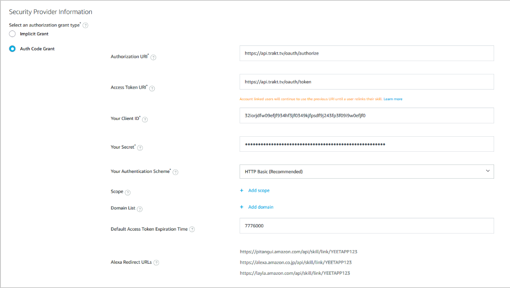

# Trakt.tv Alexa skill

A simple app to connect to the Trakt.tv API and add/remove shows/movies from a Trakt list

## Installation

You will need to create a Trakt.tv app from [here](https://trakt.tv/oauth/applications) to get your Client ID & Client Secret.

You will need both when you create your own Alexa app [here](https://developer.amazon.com/alexa/console/ask)

You need to enable account linking in your Alexa app,
settings should look something like this



With that done, You can use the JSON editor and copy all of package.json into the JSON editor

After that you need to upload the lambda folder to either Alexa hosted or your own host.

Save, build and deploy, and you should be good to enable the app in your Alexa app.

>"SKILLS AND GAMES" -> "Your Skills" -> "Dev"

## Usage
###### Adding/removing movies or shows
```python
"Alexa tell %myinvocationname to add the movie iron man"

"Alexa tell %myinvocationname to add the movie iron man to my list 'test' "

"Alexa tell %myinvocationname to remove the movie iron man"

"Alexa tell %myinvocationname to add the show The walking dead"
```
###### Changing your default list
```python
"Alexa tell %myinvocationname to add the show The walking dead to my list 'test'"

"Alexa tell %myinvocationname set my list to 'example'"

```
###### Finding what's on your calendar
```python
"Alexa ask %myinvocationname what is on Trakt today"

"Alexa ask %myinvocationname what movies are on tomorrow"

"Alexa ask %myinvocationname what shows are on trakt next week"

```

###### Finding if a movie or show is on your list
```python
"Alexa ask %myinvocationname if the movie Avatar on a list"

"Alexa ask %myinvocationname if the show The walking dead on a list"

```


###### Getting the popular list (this only works with movies)
```python
"Alexa ask %myinvocationname Check the list box office"

"Alexa ask %myinvocationname Check the list trending"

"Alexa ask %myinvocationname Check the list popular"

"Alexa ask %myinvocationname Check the list watched"

"Alexa ask %myinvocationname Check the list collected"

"Alexa ask %myinvocationname Check the list Anticipated"
```

## License
[MIT](https://choosealicense.com/licenses/mit/)
